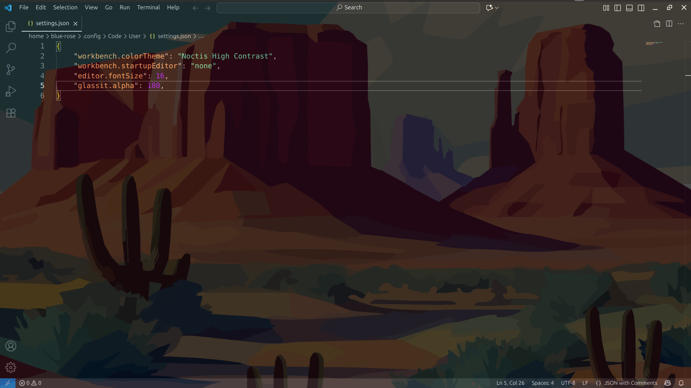
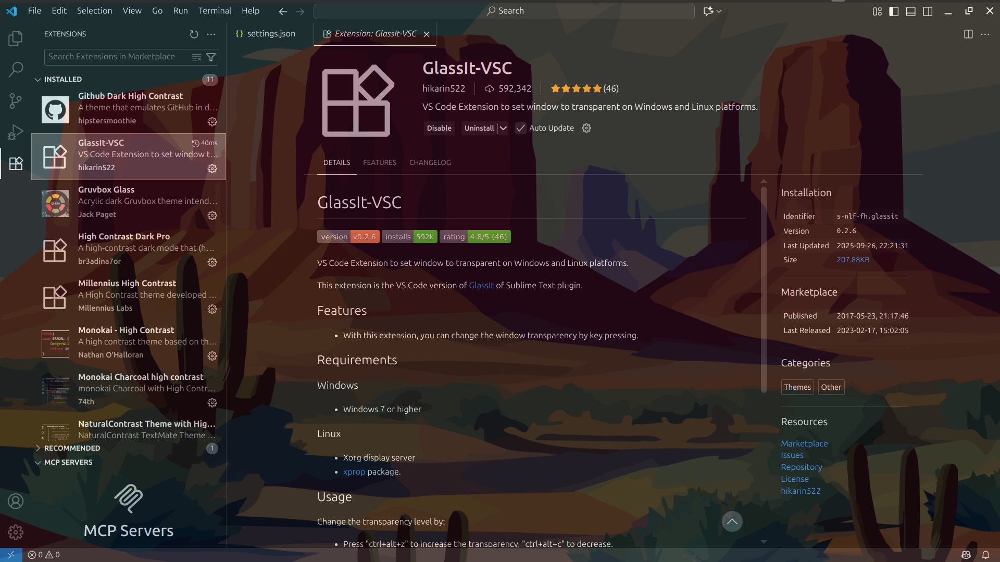
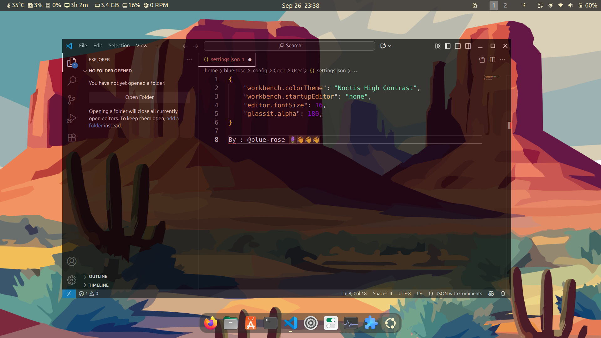

# Glassy VSCode Rice 🫕 / GNOME 🌿
Guys This is truly amazing!🎊
 I had been looking for a trick like this for a long time, but it was hard to find one that works on GNOME or Windows.

---

## 📸 Screenshot

  

### Its Completely Readable

---

I’m really in love with my VSCode now! 💙🥶🧡  
It turned out super clean and perfectly readable — a nice, hassle-free rice for anyone who wants a glassy, transparent VSCode setup.  

This setup is running on **GNOME (Ubuntu🍊)** in my case.🍻

---

## ⚙️ What’s inside?
- **Desktop:** Ubuntu / Wayland (will work on windows too!)
- **Editor:** Visual Studio Code  
- **Extension:** GlassIt-VSC
- **Theme:** Noctis High Contrast
- **Extras:** Clean and readable config, no fancy hacks needed  

---

## 🚀 How to use

1. install **GlassIt-VSC** extension
   + to set window transparent on Windows and Linux platforms.
   + https://marketplace.visualstudio.com/items?itemName=s-nlf-fh.glassit

### 🍻 HERE IS My Trick :
2. **Use a High Contrasts Theme** from vscode!
   - 'Noctis High Contrast' in my case , choose what u **prefer**

   - important to use high contrast thm!
    
   ---
  ❤️🧡 *i hope u enjoy this* 🧡❤️
https://github.com/white-rose27/Vscode-transparenty.git
